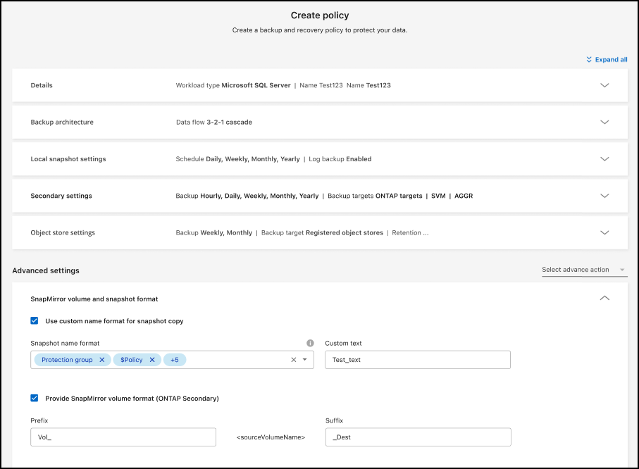

= Carga de trabajo de Microsoft SQL Server compatible con disponibilidad general (GA)
:allow-uri-read: 

=== Carga de trabajo de Microsoft SQL Server compatible con disponibilidad general (GA)

La compatibilidad con cargas de trabajo de Microsoft SQL Server ahora está disponible de manera general (GA) en NetApp Backup and Recovery. Las organizaciones que utilizan un entorno MSSQL en ONTAP, Cloud Volumes ONTAP y Amazon FSx for NetApp ONTAP ahora pueden aprovechar este nuevo servicio de respaldo y recuperación para proteger sus datos.

Esta versión incluye las siguientes mejoras en la compatibilidad de la carga de trabajo de Microsoft SQL Server con respecto a la versión preliminar anterior:

* * Sincronización activa de SnapMirror *: esta versión ahora admite la sincronización activa de SnapMirror (también conocida como SnapMirror Business Continuity [SM-BC]), que permite que los servicios comerciales sigan funcionando incluso ante una falla total del sitio y permite que las aplicaciones conmuten por error de manera transparente mediante una copia secundaria. NetApp Backup and Recovery ahora admite la protección de bases de datos de Microsoft SQL Server en una configuración de Metrocluster y sincronización activa de SnapMirror . La información aparece en la sección *Estado de almacenamiento y relación* de la página Detalles de protección. La información de la relación se muestra en la sección *Configuración secundaria* actualizada de la página Política.
+
Referirse a https://docs.netapp.com/us-en/data-services-backup-recovery/br-use-policies-create.html["Utilice políticas para proteger sus cargas de trabajo"] .

+
image:../media/screen-br-sql-protection-details.png["Página de detalles de protección para la carga de trabajo de Microsoft SQL Server"]

* *Compatibilidad con múltiples buckets*: ahora puede proteger los volúmenes dentro de un entorno de trabajo con hasta 6 buckets por entorno de trabajo en diferentes proveedores de nube.
* *Licencias y actualizaciones de prueba gratuitas* para cargas de trabajo de SQL Server: ahora puede utilizar el modelo de licencias de NetApp Backup and Recovery existente para proteger las cargas de trabajo de SQL Server. No existe ningún requisito de licencia independiente para las cargas de trabajo de SQL Server.
+
Para más detalles, consulte https://docs.netapp.com/us-en/data-services-backup-recovery/br-start-licensing.html["Configurar licencias para NetApp Backup and Recovery"] .

* *Nombre de instantánea personalizado*: ahora puede usar su propio nombre de instantánea en una política que rige las copias de seguridad de las cargas de trabajo de Microsoft SQL Server. Ingrese esta información en la sección *Configuración avanzada* de la página de Política.
+

+
Referirse a https://docs.netapp.com/us-en/data-services-backup-recovery/br-use-policies-create.html["Utilice políticas para proteger sus cargas de trabajo"] .

* *Prefijo y sufijo de volumen secundario*: puede ingresar un prefijo y un sufijo personalizados en la sección *Configuración avanzada* de la página Política.
* *Identidad y acceso*: Ahora puedes controlar el acceso de los usuarios a las funciones.
+
Referirse a https://docs.netapp.com/us-en/data-services-backup-recovery/br-start-login.html["Inicie sesión en NetApp Backup and Recovery"] y https://docs.netapp.com/us-en/data-services-backup-recovery/reference-roles.html["Acceso a las funciones de NetApp Backup and Recovery"] .

* *Restaurar desde el almacenamiento de objetos a un host alternativo*: ahora puedes restaurar desde el almacenamiento de objetos a un host alternativo incluso si el almacenamiento principal está inactivo.
* *Datos de respaldo del registro*: La página de detalles de protección de la base de datos ahora muestra copias de seguridad del registro. Puede ver la columna Tipo de copia de seguridad que muestra si la copia de seguridad es una copia de seguridad completa o una copia de seguridad de registro.
* *Panel de control mejorado*: el panel de control ahora muestra los ahorros de almacenamiento y clonación.
+
image:../media/screen-br-dashboard3.png["Panel de control de NetApp Backup and Recovery"]

=== Mejoras en la carga de trabajo de volumen de ONTAP

* *Restauración de múltiples carpetas para volúmenes ONTAP *: hasta ahora, podías restaurar una carpeta o varios archivos a la vez desde la función Explorar y restaurar. NetApp Backup and Recovery ahora ofrece la posibilidad de seleccionar varias carpetas a la vez mediante la función Explorar y restaurar.
* *Ver y administrar copias de seguridad de volúmenes eliminados*: el panel de NetApp Backup and Recovery ahora ofrece una opción para mostrar y administrar los volúmenes que se eliminan de ONTAP. Con esto, puede ver y eliminar copias de seguridad de volúmenes que ya no existen en ONTAP.
* *Eliminar por la fuerza las copias de seguridad*: en algunos casos extremos, es posible que desee que NetApp Backup and Recovery ya no tenga acceso a las copias de seguridad. Esto podría suceder, por ejemplo, si el servicio ya no tiene acceso al depósito de copias de seguridad o las copias de seguridad están protegidas por DataLock pero ya no las desea. Anteriormente, no podía eliminarlos usted mismo y necesitaba llamar al soporte de NetApp . Con esta versión, puede utilizar la opción para forzar la eliminación de copias de seguridad (a nivel de volumen y entorno de trabajo).

CAUTION: Utilice esta opción con cuidado y sólo en necesidades de limpieza extremas. NetApp Backup and Recovery ya no tendrá acceso a estas copias de seguridad incluso si no se eliminan del almacenamiento de objetos. Necesitará ir a su proveedor de nube y eliminar manualmente las copias de seguridad.

Referirse a https://docs.netapp.com/us-en/data-services-backup-recovery/prev-ontap-protect-overview.html["Proteja las cargas de trabajo de ONTAP"] .
